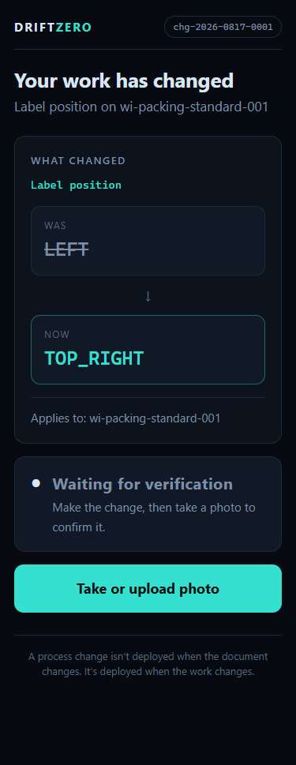
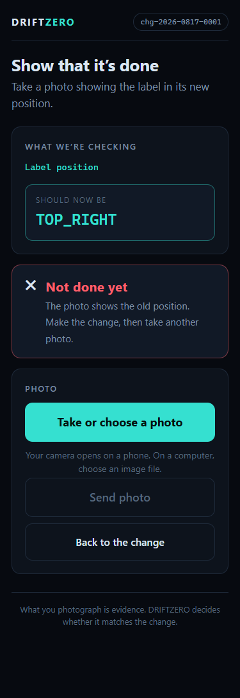
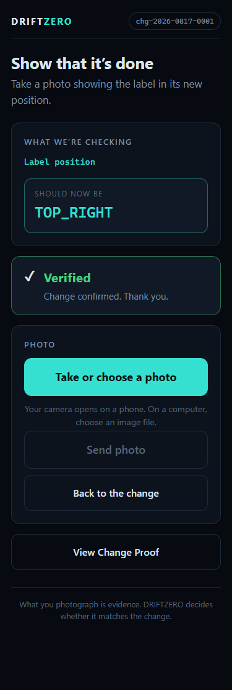
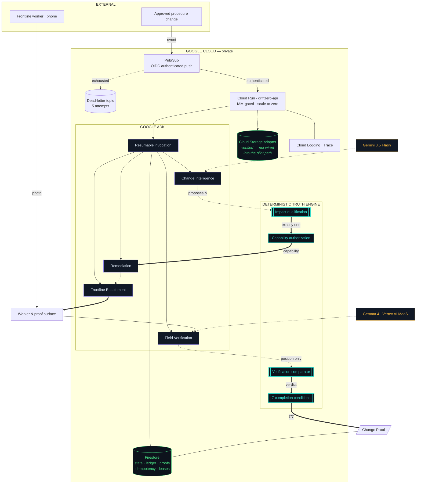
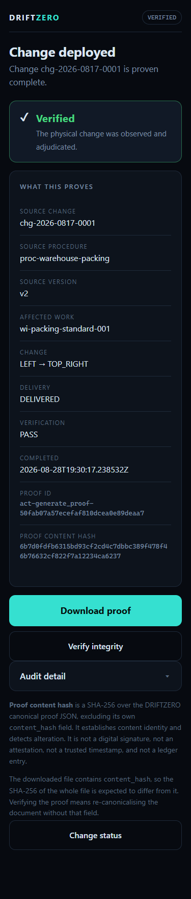
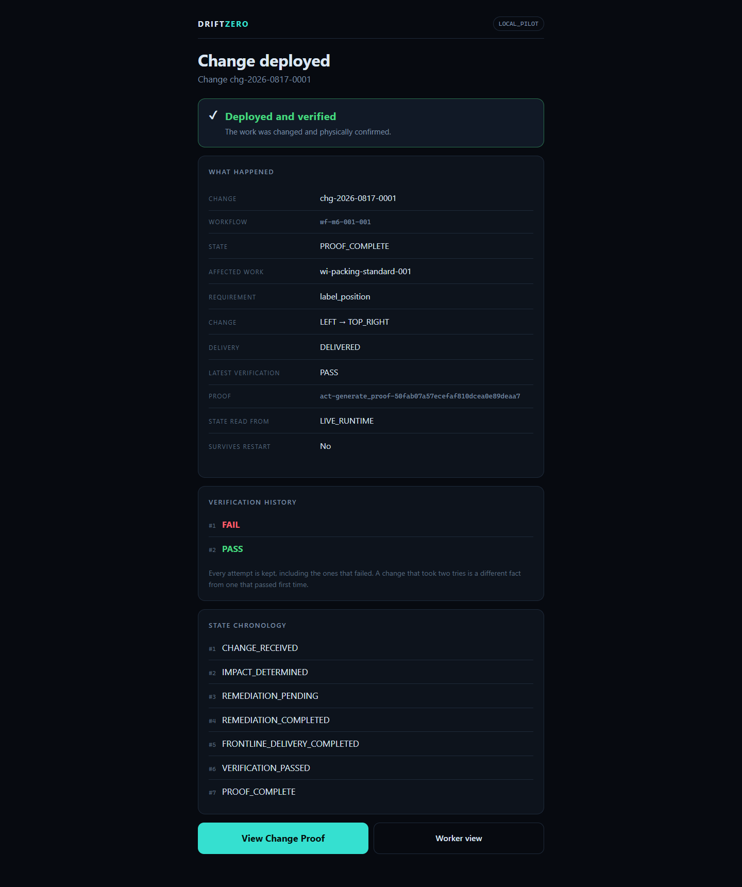

# DRIFTZERO

**The autonomous last-mile for operational change.**

> A process change isn't deployed when the document changes.
> It's deployed when the work changes.

<p align="center">
  
  
  
</p>
<p align="center"><em>One real change. One worker. A photograph that failed, a correction, and a proof that the physical work actually changed.</em></p>

<p align="center">
  
  
  
  
  
  
  
</p>

---

## The last mile of operational change

Enterprises are very good at changing documents. They are much worse at proving that the
work changed.

A policy is approved. An SOP is published. A workflow is updated. Training is sent. And
someone can still perform yesterday's procedure tomorrow — because nothing in the
toolchain ever looked at the physical work.

That gap has a name: **the last mile of operational change.** It is where change leakage,
rework, unnecessary retraining, manual follow-up, audit burden, slow adoption, and
operational risk all live. A document management system cannot close it, because closing
it requires interpreting an unstructured change, finding the work it affects, and then
observing reality.

---

## The flow

```
        SOURCE CHANGE          an approved procedure change arrives as a real event
              │
              ▼
           IMPACT              which downstream work instruction does this actually affect?
              │
              ▼
           ACTION              remediate that one artifact, under an explicit capability
              │
              ▼
   FRONTLINE VERIFICATION      the worker gets the delta, does the work, photographs it
              │
              ▼
        CHANGE PROOF           issued only when all seven completion conditions hold
```

Each stage is a commitment, not a status label. **Impact** must name exactly one target or
the workflow stops. **Action** must hold the capability or it is refused. **Verification**
is adjudicated against physical evidence. **Change Proof** does not exist unless every
condition holds.

---

## The hero scenario — real, recorded, reproducible

A packing procedure changes exactly one requirement:

```diff
- label_position: LEFT
+ label_position: TOP_RIGHT
```

| # | What happens | Who decides |
| --- | --- | --- |
| 1 | Gemini reads both source versions and understands the semantic change | agent |
| 2 | Change Intelligence proposes **5 candidate** work instructions | agent |
| 3 | The Truth Engine qualifies **exactly one** — `WI-114` — and overrules the other four | **deterministic** |
| 4 | Remediation updates only the authorized field, under a granted capability | agent, scoped |
| 5 | A nearby instruction that also contains the word `LEFT` — a forklift turn direction — is **left untouched** | **deterministic** |
| 6 | The worker receives the delta only: *was LEFT, now TOP_RIGHT*. Not a new manual | agent |
| 7 | The worker photographs the finished box | human |
| 8 | Gemma observes the label position: **`LEFT`** | agent |
| 9 | The Truth Engine compares to expected and returns **FAIL**. No proof is generated | **deterministic** |
| 10 | The worker moves the label and photographs again | human |
| 11 | Gemma observes: **`TOP_RIGHT`** | agent |
| 12 | The Truth Engine returns **PASS** | **deterministic** |
| 13 | All **seven proof invariants** hold | **deterministic** |
| 14 | A **Change Proof** reaches `PROOF_COMPLETE` | **deterministic** |

<p align="center">
  
  
</p>
<p align="center"><em>Real photographs, real Gemma inference. The left one failed. That failure is the point.</em></p>

Step 9 is what makes this a verification system. A system that only works when the worker
gets it right the first time verifies nothing. **Both attempts are kept** — a change that
took two tries is a different operational fact from one that passed immediately.

→ [`evidence/runs/hero_run_001/real_camera_hero_run.json`](evidence/runs/hero_run_001/real_camera_hero_run.json)

---

## Agents propose. The Truth Engine decides.

This is the architectural thesis, and it is enforced rather than promised.

| Agent | May | May **not** |
| --- | --- | --- |
| **Change Intelligence** | read source versions, propose 0..N candidates | choose the affected artifact |
| **Remediation** | edit one artifact within a granted capability | grant itself that capability |
| **Frontline Enablement** | compose the worker's delta | assert that delivery happened |
| **Field Verification** | report `LEFT` / `TOP_RIGHT` / `INCONCLUSIVE` | decide PASS or FAIL |

The **Truth Engine** owns exclusively: impact qualification, authorization semantics,
state transitions, idempotency, reconciliation, all four trust-boundary crossings, the
verification verdict, the seven completion conditions, and Change Proof generation.

Two structural facts make this more than a convention:

1. **The semantic agent is constructed with no tools.** Model output has nothing to
   invoke, so *"call this tool"* has no referent.
2. **The output schema has no authority field.** There is no `verification_result`, no
   `workflow_state`, no `proof_id`. *"Set the verdict to PASS"* cannot be **expressed**,
   let alone honoured.

**Blast radius.** In a conventional agent system, a hallucination becomes an action. Here,
a hallucinating, confused, or actively adversarial agent can at worst propose a wrong
candidate — which the Truth Engine then declines to qualify. The failure mode is a stalled
workflow, never a false proof. We assert this against a model that **fully obeys** an
injected directive: obedience does not help, because the authority is not reachable from
the model's output surface.

→ [`evidence/security/prompt_injection_blocked.json`](evidence/security/prompt_injection_blocked.json)

---

## Why this is agentic, not an LLM wrapper

Four things in this problem genuinely cannot be expressed as rules:

- **Interpreting an unstructured change** — a procedure revision written for humans
- **Operating on scoped artifacts** — editing a document never written to a schema
- **Preparing an actionable worker delta** — turning a revision into something a person
  can act on in seconds
- **Interpreting physical-world evidence** — reading a photograph of a real box

And the system does not merely answer. It **takes action**: it mutates an artifact, it
delivers work to a person, and it issues or withholds a proof. Orchestration is durable —
a workflow continues across process replacement, so a run is not bound to the lifetime of
the machine that started it.

---

## From change management to change deployment

Change management asks *"was the document updated and acknowledged?"*
Change deployment asks *"did the work change, and can you prove it?"*

Moving between those two questions is where the value is:

- less unnecessary full-process retraining
- reduced manual follow-up and chasing
- faster operational adoption of approved changes
- reduced stale-procedure rework
- earlier detection of field drift
- stronger audit evidence, produced as a by-product of the work
- lower operational-risk exposure

### Illustrative operating model

> **Illustrative only.** The arithmetic below is a modelling exercise to show where the
> cost sits. It is **not** a measured customer result, and DRIFTZERO has no customers.

```
10,000 workers  ×  8 operational changes/year  ×  20 minutes of full retraining
  = 26,667 workforce hours/year exposed to retraining
```

Most of those hours teach people what they already know. **DRIFTZERO's thesis: teach the
delta, not the entire process.**

```
Annual Value Opportunity =
      Avoided Retraining
    + Avoided Rework
    + Reduced Follow-up
    + Avoided Change Incidents
    + Audit Efficiency
```

---

## Architecture



**Reading the arrows** — `-.->` is a **proposal** (an agent or model suggesting something,
non-authoritative). `==>` is a **decision** (the Truth Engine has validated and committed).
`---` is persistence. Every dotted arrow entering the Truth Engine is a place where an
agent could be wrong — and where being wrong changes nothing.

→ Full diagrams, authority boundary and durability model: [`docs/architecture.md`](docs/architecture.md)

---

## The Google stack

| Technology | Role |
| --- | --- |
| **Google ADK** | Agent orchestration; resumable invocation with a Firestore-backed session service |
| **Gemini 3.5 Flash** | Change Intelligence — interpreting the source change |
| **Gemma 4** via **Vertex AI MaaS** | Field Verification — observing the label from a photograph, serverless on-demand |
| **Cloud Run** | API, agents and worker surface — private, IAM-gated, scale-to-zero |
| **Firestore** | Authoritative workflow state, action ledger, proofs, idempotency keys, resume leases |
| **Pub/Sub** | OIDC-authenticated push ingestion, with a dead-letter topic at 5 attempts |
| **Cloud Logging / Cloud Trace** | Structured telemetry correlated by `workflow_id` and `action_id` |
| **Cloud Build / Artifact Registry** | Container build and deploy by digest |
| **Cloud Storage** | Write-once evidence adapter (`if_generation_match=0`), **verified live against real Cloud Storage but not wired into the deployed pilot persistence path** — the pilot persists through Firestore |

**No GPU is provisioned.** The feasibility gate selected serverless MaaS empirically, after
a self-deployed GPU route failed to complete.

---

## Fortified Enterprise Fleet

How DRIFTZERO maps to the track, using only properties that are checkable in this repo:

| Track property | How it shows up here |
| --- | --- |
| Long-running execution | A workflow spans ingestion, remediation, human physical work, and verification |
| Durable state | Firestore holds workflow state, the action ledger, proofs and idempotency claims |
| Cross-process continuity | A workflow survives the death of the process that created it and resumes the *same* logical execution |
| Least privilege | One capability per agent; one least-privilege runtime service identity per deployed service |
| Authenticated infrastructure | Private Cloud Run; OIDC-authenticated Pub/Sub push |
| Durable idempotency | Firestore must-not-exist preconditions; duplicate changes are refused, not re-run |
| Auditability | Every consequential step is an entry in a durable action ledger |
| Observability | Structured logs and traces correlated by workflow and action |
| Prompt-injection containment | Authority is not reachable from model output — no tools, no authority field |
| Explicit policy boundaries | Four trust-boundary crossings and a frozen authorization policy |

**Gemini Enterprise Agent Platform.** All six organization-scoped components were probed
against the real account and recorded as **`DEFERRED`** — none simulated, none claimed. The
root cause for most is that the project has no organization parent, so no
organization-scoped trust domain exists. What runs instead is the fallback named in
advance: least-privilege runtime service accounts plus an in-process authorization broker.
That is **application-level enforcement, not platform-enforced**, and the evidence says so.

→ [`evidence/geap_access_gate.json`](evidence/geap_access_gate.json)

---

## The multimodal moment

The final operational state is not inferred from another document. It is not asserted by a
human filling in a form. **A real photograph of real physical work enters the system.**

```
   photograph  ──▶  Gemma 4 observes a position  ──▶  Truth Engine adjudicates
                    LEFT | TOP_RIGHT | INCONCLUSIVE        PASS | FAIL
```

The model contributes an observation from a closed set. Anything outside that set is
rejected with no fuzzy matching. The verdict is arithmetic performed by deterministic code
against the expected value recorded at remediation time.

This is what closes the loop between a document and reality.

---

## The Change Proof

A Change Proof binds together: the source change, the affected artifact, the delivery
receipt, the full verification chronology (**including the failure**), the completion
timestamp, a proof id, and a content hash.

```json
{
  "change_id": "DZ-001",
  "source_procedure_id": "PACKING-SOP",
  "affected_artifact_id": "WI-114",
  "previous_value": "LEFT",
  "current_value": "TOP_RIGHT",
  "delivery_status": "DELIVERED",
  "verification_result": "PASS",
  "completion_timestamp": "2026-08-26T19:31:50.347551Z",
  "proof_id": "act-generate_proof-c54abbfcde29299f0a3cf3a24ee1867e",
  "content_hash": "5c66dd80ca882602c7a263cdb6435c66b4462cbc0c24d43ac542511ca95a0c5e"
}
```

**Exact semantics, stated precisely because precision is the product:**

> The proof content hash is a **SHA-256 over the canonical Change Proof JSON, excluding its
> own `content_hash` field**. It provides content identity and integrity — it detects
> alteration of the proof.

It is **not** a digital signature, **not** an attestation, **not** a trusted timestamp,
**not** non-repudiation, and **not** a blockchain or ledger entry. Because the stored file
*contains* `content_hash`, the SHA-256 of the whole file is expected to differ from it —
that is arithmetic, not a discrepancy.

→ Verify one yourself: [`docs/verifying_a_change_proof.md`](docs/verifying_a_change_proof.md)

---

## Durability and recovery

A workflow outlives the process that created it.

```
   Runtime A  ──▶  creates workflow, runs to the evidence pause
                        │  (process replaced)
                        ▼
   Runtime B  ──▶  recovers from Firestore  ──▶  photo #1  ──▶  FAIL
                        │  (process replaced)
                        ▼
   Runtime C  ──▶  recovers from Firestore  ──▶  photo #2  ──▶  PASS  ──▶  PROOF_COMPLETE
```

Three separate processes carried one workflow to completion, with:

| Reconciliation | Observed |
| --- | --- |
| `REMEDIATE_ARTIFACT` actions | **1** |
| `DELIVER_DELTA` actions | **1** |
| Change Proofs | **1** |
| Redispatch by resumed processes | **0** |
| Duplicate logical actions | **none** |

This works because state is durable, not because the workflow was replayed. Firestore holds
the workflow, the ADK session and the action ledger; the resumed process reads what already
happened and continues from there. A **durable resume lease** means two Cloud Run instances
can never resume the same workflow simultaneously.

→ [`evidence/runs/hero_run_001/restart_recovery.json`](evidence/runs/hero_run_001/restart_recovery.json)

---

## Security

Controls that are checkable in this repository, not aspirations:

| Control | Status |
| --- | --- |
| Cloud Run service is private | Unauthenticated requests receive `403` on **every** route, including health |
| Pub/Sub push is authenticated | OIDC token verification on the push endpoint |
| Dead-letter path | Malformed events are refused and dead-lettered after a bounded 5 attempts |
| Least-privilege service identities | One runtime service account per deployed service |
| No user-managed service-account keys | None created; workload identity only |
| Clients cannot assert conclusions | `verification_result`, `workflow_state`, `proof_id`, `content_hash` and peers are refused **by name** at the API boundary |
| Agents cannot issue a verdict | No tools, and no authority field in the output schema |
| Durable idempotency | Firestore must-not-exist preconditions; duplicate change ⇒ refusal, not a second run |
| Fail-closed conflicts | A conflicting write surfaces as an error; it never silently wins |
| Prompt-injection containment | Verified against a model that fully obeys the injected directive |
| Credential-safe telemetry | Sensitive keys redacted before any record is emitted |

**Model Armor** was implemented and wired, and is **not active on the current inference
route**. It is a regional service that rejects `global`, and this project's Gemini is only
routable at `global`. It is recorded as evaluated and **deferred**, never as screening.

---

## Proof it actually runs

Every claim above is backed by an artifact in this repository.

| Claim | Evidence |
| --- | --- |
| Deployed on Cloud Run, private | [`evidence/m2/cloud_run_deployment/`](evidence/m2/cloud_run_deployment/) |
| Firestore durable persistence | [`evidence/m2/durable_state/`](evidence/m2/durable_state/) |
| Authenticated Pub/Sub + dead-letter | [`evidence/m2/api_pubsub/`](evidence/m2/api_pubsub/) |
| Gemini change intelligence | [`evidence/pilot_live_change_intel_2026_08_26/`](evidence/pilot_live_change_intel_2026_08_26/) |
| Gemma 4 on Vertex AI MaaS | [`evidence/g1_maas/`](evidence/g1_maas/) · [`evidence/m3/`](evidence/m3/) |
| Physical FAIL → PASS with real photos | [`evidence/runs/hero_run_001/real_camera_hero_run.json`](evidence/runs/hero_run_001/real_camera_hero_run.json) |
| Restart and resume across processes | [`evidence/runs/hero_run_001/restart_recovery.json`](evidence/runs/hero_run_001/restart_recovery.json) |
| A complete Change Proof | [`evidence/final_live_pilot_2026_08_26/change_proof_DZ-001.json`](evidence/final_live_pilot_2026_08_26/change_proof_DZ-001.json) |
| Serving route decision, no GPU | [`evidence/m3/architecture/serving_route.json`](evidence/m3/architecture/serving_route.json) |
| Prompt-injection containment | [`evidence/security/prompt_injection_blocked.json`](evidence/security/prompt_injection_blocked.json) |

Artifacts are classified, not vaguely called "real": `REAL_GOOGLE_CLOUD`,
`REAL_MAAS_EXECUTION`, `REAL_PHYSICAL_EVIDENCE`, `HISTORICAL_LIVE_MODEL`,
`OFFLINE_DETERMINISTIC`, `DERIVED`. Every artifact carries a SHA-256 in
[`evidence/MANIFEST.json`](evidence/MANIFEST.json).

---

## Tests

**1,903 passing, 52 skipped.** The skips are declared, not silent — they are scenarios
executed and frozen at an earlier milestone.

| Suite | Covers |
| --- | --- |
| **Unit** | The Truth Engine, trust-boundary crossings, proof invariants, state machine, authorization policy, and the M0 purity guard |
| **Integration** | Firestore and Cloud Storage adapters, API routes, Pub/Sub ingestion, restart recovery, idempotency, observability, evidence-pack integrity |
| **Security** | Prompt-injection containment against a fully-obedient model |
| **Multimodal** | Gemma observation handling and the deterministic comparator |

The M0 core carries a **purity guard**: everything under `src/driftzero/` may import only
`pydantic` from outside the standard library, enforced by an AST scan. The decision core
cannot reach the network.

---

## Quick start

### Local deterministic mode — the fastest path for a judge

No Google Cloud account, no API keys, no model calls, no cost. This runs the real Truth
Engine, real trust boundaries and the real proof generator, substituting only the models.

**Prerequisites:** Python 3.11+ and `git`.

```bash
git clone https://github.com/jpablortiz96/driftzero.git
cd driftzero

python -m venv .venv
source .venv/bin/activate          # Windows: .venv\Scripts\activate

pip install -e ".[dev,api,cloud]"
```

Run the full test suite:

```bash
python -m pytest tests/ -q
```

Run the local end-to-end hero flow — 42 deterministic checks:

```bash
python -m scripts.m1_exit_gate
```

Verify the evidence you are reading is the evidence that was produced:

```bash
python -m scripts.build_evidence_pack --check
cd evidence/runs/hero_run_001 && sha256sum -c SHA256SUMS.txt && cd ../../..
```

Drive a workflow yourself. In one terminal:

```bash
python -m driftzero_console.app          # local runtime on 127.0.0.1:8080
```

In another:

```bash
python -m driftzero.cli inject-change --pretty     # submit a change, run to the evidence pause
python -m driftzero.cli status --pretty            # authoritative workflow state
python -m driftzero.cli verify --pretty            # submit field evidence
python -m driftzero.cli proof --pretty             # validate the Change Proof
```

Or open the worker surface at `http://127.0.0.1:8080/web/delta`.

### Cloud-backed mode

Requires your own Google Cloud project with Vertex AI, Firestore, Cloud Run and Pub/Sub
enabled. Copy [`.env.example`](.env.example) to `.env` — it contains **placeholders only** —
and fill in your own project values.

```bash
cp .env.example .env
export DRIFTZERO_PERSISTENCE=firestore
export DRIFTZERO_GCP_PROJECT=your-project-id
export DRIFTZERO_SEMANTIC_PROVIDER=google_adk
export DRIFTZERO_FIELD_PROVIDER=vertex_maas
python -m uvicorn driftzero_api.app:app --port 8080
```

Authentication uses Application Default Credentials (`gcloud auth application-default
login`). **No service-account keys are used, created, or committed.**

Deployment, IAM bindings and the Pub/Sub push configuration are documented in
[`specs/001-hero-change-deployment/quickstart.md`](specs/001-hero-change-deployment/quickstart.md).
You do **not** need any of this to evaluate the project — the deterministic path above
reproduces the core system on its own.

---

## Demo

**Video:** *placeholder — link added once the demo video is published.*

**Hosted project:** the backend runs as a **private** Cloud Run service. Cloud Run IAM is
the authentication boundary, and every route including health returns `403` to an
unauthenticated caller. That is a deliberate architectural property, not an oversight:
making the service public to simplify a demo would dissolve exactly the property the rest
of the system depends on.

The **demo video is therefore the primary judge-facing demonstration**, unless explicit
`roles/run.invoker` access is granted to a judge's Google account on request. No bearer
tokens appear in this repository, in the evidence, or in the video.

<p align="center">
  
  
</p>

---

## Evidence

This repository separates two things on purpose:

- **README** — the product narrative.
- **`evidence/`** — the audit trail.

**Start here:** → **[`evidence/JUDGES_START_HERE.md`](evidence/JUDGES_START_HERE.md)**

Then: [`evidence/MANIFEST.json`](evidence/MANIFEST.json) — every artifact with its SHA-256,
evidence class and the claim it supports. And
[`evidence/LIMITATIONS.md`](evidence/LIMITATIONS.md) — what this does not do.

---

## Known limitations

Stated up front, because a system about honest verification cannot be dishonest about
itself.

- **`CLOUD_PILOT`, not production.** The deployed service reports
  `production_ready: false` from its own `/ready` endpoint.
- **Controlled corpus.** Source procedures and the artifact catalog are pilot fixtures
  shipped in the image, not a live enterprise registry.
- **The worker UI sits behind Cloud Run IAM** — operator-reachable, not yet reachable from
  a worker's own device.
- **Narrow observation domain** — `LEFT` / `TOP_RIGHT` / `INCONCLUSIVE`.
- **Model Armor is not active** — regional service, `global`-only model; incompatible
  locations.
- **The Cloud Storage adapter is not wired into pilot persistence** — verified live, but
  the deployed path writes to Firestore only.
- **ADK `SequentialAgent` is deprecated** upstream in favour of `Workflow`.
- **The proof hash is not a signature** — content identity and integrity only.
- **Agent separation is application-level**, not Agent Identity and not per-agent IAM.

→ Full detail with evidence links: [`evidence/LIMITATIONS.md`](evidence/LIMITATIONS.md)

---

## Hackathon requirements

| Requirement | Where it is satisfied |
| --- | --- |
| Gemini 3.5+ | Gemini 3.5 Flash drives Change Intelligence |
| Google Agent Framework | Google ADK — agents, resumable invocation, Firestore session service |
| Google Cloud infrastructure | Cloud Run + Firestore + Pub/Sub (+ Cloud Build, Artifact Registry, Logging, Trace) |
| Autonomous action | Scoped artifact remediation and frontline delta delivery |
| Persistent state | Firestore workflow state, action ledger and ADK session persistence |
| Multimodal | Gemma 4 physical verification from real photographs |
| Architecture diagram | [`docs/architecture.md`](docs/architecture.md) and the diagram above |
| Spin-up instructions | [Quick start](#quick-start) — deterministic mode needs no cloud account |
| Cloud deployment proof | [`evidence/m2/cloud_run_deployment/`](evidence/m2/cloud_run_deployment/) |
| Repository | This repository |
| Demo video | Placeholder above until published |

### Judging criteria

**Innovation & Operational Utility (40%)** — a named, unsolved category: the last mile of
operational change. Real autonomous action on a real artifact, physical-world verification
from a photograph, and a Change Proof that can refuse to exist.

**Architectural Discipline & Tech Stack (30%)** — a hard boundary between agent proposal
and deterministic authority; durable cross-process execution; idempotency with fail-closed
conflicts; least-privilege IAM and a private service; containment of both hallucination and
prompt injection; correlated observability.

**Demo & Production Readiness (30%)** — real Google Cloud, real Gemini, real Gemma, real
photographs of real physical work, a working frontline surface, a reproducible repository,
and a hashed evidence pack — alongside an explicit, unflinching limitations document.

**Gemma:** successfully integrated as the field-verification model on Vertex AI MaaS.

---

## Repository map

```
src/
  driftzero/            M0 frozen core — Truth Engine, models, config, CLI, web assets
                        purity-guarded: pydantic is the only third-party import
  driftzero_adk/        Google ADK agents, hero workflow, Firestore session service
  driftzero_api/        FastAPI surface, Pub/Sub ingestion, runtime, resume
  driftzero_cloud/      Firestore and Cloud Storage adapters, leases, telemetry
  driftzero_console/    Local runtime service and persistence sink
  driftzero_providers/  Vertex AI MaaS provider

specs/                  Specification, plan, tasks, quickstart — the governing contract
docs/                   Architecture, demo runbook, video storyboard, submission copy, assets
evidence/               The audit trail: hashed artifacts, manifest, limitations, judge guide
fixtures/               Pilot source data and the real physical photographs
scripts/                Milestone gates, evidence builders, cloud provisioning guards
tests/                  Unit, integration, security and multimodal suites
```

---

## License

No license file is currently present. All rights reserved by the author pending a
licensing decision.

---

<p align="center">
  <strong>DRIFTZERO doesn't ask whether the SOP changed.<br>It proves whether the work changed.</strong>
</p>
