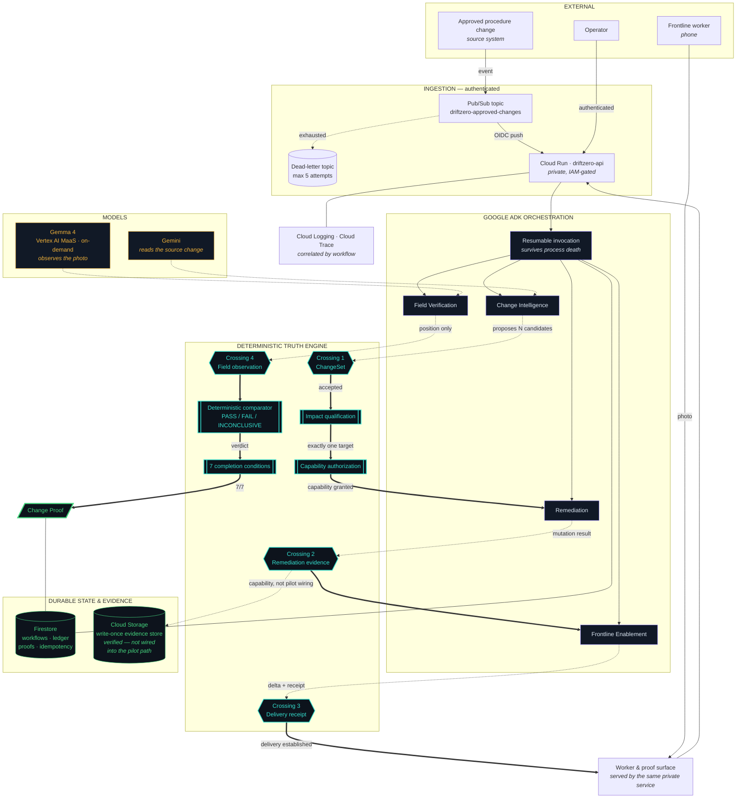
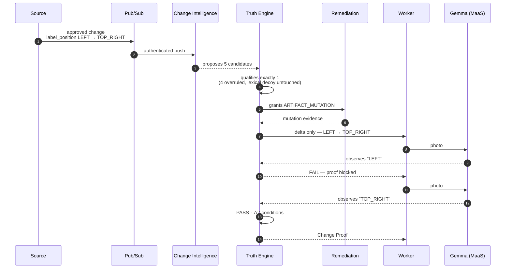
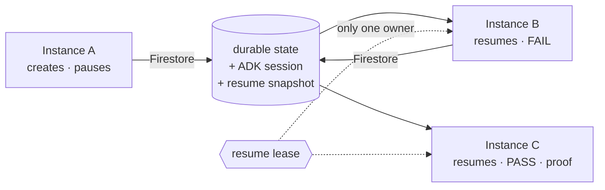

# DRIFTZERO — architecture

The one idea to hold while reading this: **agents propose, the Truth Engine decides.**
Every arrow below either carries a proposal or carries a decision, and the diagram is
drawn so you can tell which is which.

---

## The system

**Reading the arrows**

| Arrow | Meaning |
| --- | --- |
| `-.->` dotted | **A proposal.** An agent or a model suggesting something. Non-authoritative until a crossing accepts it. |
| `==>` thick | **A decision.** The Truth Engine has validated and committed. |
| `---` plain | **Persistence.** Durable state, not a decision. |

Every dotted arrow into the Truth Engine is a place where an agent could be wrong,
compromised, or adversarial — and where being wrong changes nothing.

**One honest caveat about the diagram.** The Cloud Storage write-once evidence store is
implemented and was verified against real Cloud Storage, but the **deployed pilot
persists through Firestore only** — the runtime sink builds no evidence store, and the
bucket is currently empty. It is drawn as a capability, not as pilot wiring.

---

## The authority boundary

This is the whole design, in one table.

| | Agents may | Agents may **not** |
| --- | --- | --- |
| **Change Intelligence** | read source versions, propose 0..N candidate artifacts | choose the affected artifact |
| **Remediation** | edit one artifact within a granted capability | grant itself that capability |
| **Frontline Enablement** | compose the delta for a worker | assert that delivery happened |
| **Field Verification** | report `LEFT` / `TOP_RIGHT` / `INCONCLUSIVE` | decide PASS or FAIL |

The Truth Engine owns, exclusively: impact qualification, capability authorization, all
four crossings, the verification verdict, state transitions, the seven completion
conditions, and proof identity and hashing.

Two structural facts make this more than a convention:

1. **The semantic agent is constructed with no tools.** Model output has nothing to
   invoke, so "call this tool" has no referent.
2. **The output schema has no authority field.** There is no `verification_result`, no
   `workflow_state`, no `proof_id`. "Set the verdict to PASS" cannot be *expressed*, let
   alone honoured.

---

## The hero flow, step by step

The FAIL is not an error path bolted on afterwards — it is the point. A system that only
works when the worker gets it right first time is not verifying anything.

---

## What runs where

| Component | Google service | Notes |
| --- | --- | --- |
| API, agents, worker surface | **Cloud Run** `driftzero-api` | private, IAM-gated, scale-to-zero, max 2 instances |
| Agent orchestration | **Google ADK** | resumable invocation, Firestore-backed session |
| Semantic analysis | **Gemini** | Change Intelligence only |
| Physical observation | **Gemma 4** via **Vertex AI MaaS** | serverless on-demand — no GPU, no endpoint |
| Authoritative state | **Firestore** | workflows, action ledger, proofs, idempotency keys, resume leases |
| Immutable evidence | **Cloud Storage** | write-once via generation precondition — implemented and verified, **not wired into the deployed pilot path** |
| Event ingestion | **Pub/Sub** | OIDC push + dead-letter at 5 attempts |
| Telemetry | **Cloud Logging / Cloud Trace** | correlated by `workflow_id` and `action_id` |

**No GPU, no VM, no Cloud SQL, no load balancer, no NAT.**

---

## Durability

A workflow outlives the process that created it.

Three separate processes carry one workflow to completion. The resumed process
**redispatches nothing** — the recovered action ledger already records what happened —
and a durable lease means two Cloud Run instances can never resume the same workflow at
once.

---

## Where the enterprise-platform components sit

Every Gemini Enterprise Agent Platform component was access-checked against the real
account and recorded in [`../evidence/geap_access_gate.json`](../evidence/geap_access_gate.json).
**All six are `DEFERRED`, none simulated.** The root cause for most is that the project
has no organization parent, so no organization-scoped trust domain exists.

What runs instead is the fallback the plan named in advance: one least-privilege runtime
service account per deployed service, plus an in-process authorization broker holding one
capability per agent. That is **application-level enforcement, not platform-enforced**,
and the evidence says so.
