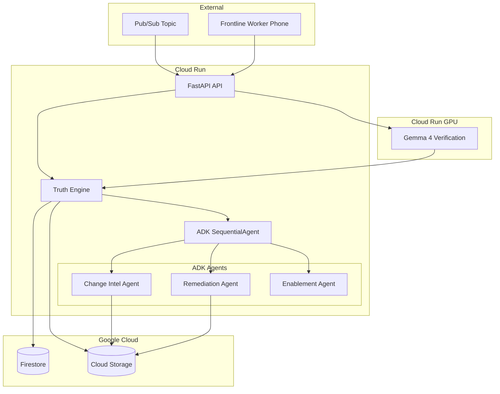

# Implementation Plan: Hero Change Deployment

**Branch**: `001-hero-change-deployment` | **Date**: 2026-08-17 | **Spec**: [spec.md](spec.md)

## Summary

DRIFTZERO's hero workflow autonomously processes an approved operational procedure change (LEFT → TOP-RIGHT label placement), identifies the affected downstream artifact, remediates it, delivers the delta to a frontline worker, verifies physical execution via camera evidence, and produces an immutable Change Proof. The implementation uses a hybrid deterministic + LLM architecture: a pure-Python Truth Engine owns all authoritative state/transitions/invariants while Google ADK Python agents handle semantic interpretation tasks (change extraction, remediation composition, delta delivery, vision observation). Gemini 3.5 Flash powers the semantic agents; Gemma 4 provides multimodal field verification; Veo 3.1 optionally generates microtraining video. Firestore is the authoritative state store; Pub/Sub provides event-driven ingestion; Cloud Run hosts the runtime; Cloud Storage holds immutable evidence.

## Technical Context

**Language/Version**: Python 3.11+
**Primary Dependencies**: google-adk>=2.0.0, google-cloud-firestore, google-cloud-pubsub, google-cloud-storage, fastapi, uvicorn, pydantic>=2.0
**Storage**: Firestore (Standard Edition) for workflow state; Cloud Storage for raw evidence/artifacts
**Testing**: pytest, pytest-asyncio
**Target Platform**: Cloud Run (serverless containers), optional Agent Runtime
**Project Type**: Multi-agent enterprise workflow service with thin web frontend
**Performance Goals**: Hero workflow completion in <5 minutes (excluding async field verification wait). Field verification response <10 seconds.
**Constraints**: Hackathon credit budget. Single developer. Scale-to-zero when idle.
**Scale/Scope**: 1 concurrent workflow sufficient for demo. Not a production platform.

## Constitution Check

*GATE: Must pass before Phase 0 research. Re-check after Phase 1 design.*

| # | Principle | Status | Notes |
|---|---|---|---|
| I | Spec Before Code | PASS | Frozen spec exists with 11 FRs, 15 SCs |
| II | Evidence Over Claims | PASS | Evidence pack designed, no invented metrics |
| III | Deterministic Truth Boundary | PASS | Truth Engine owns all authoritative logic |
| IV | Least Privilege | PASS | Per-agent permission boundaries defined |
| V | Safe Autonomous Action | PASS | 9-condition autonomy gate, REVIEW_REQUIRED default |
| VI | Persistent State ≠ LLM Memory | PASS | Firestore is authoritative, not ADK session/Memory Bank |
| VII | Observable by Default | PASS | Correlation IDs, state transition logs, agent traces |
| VIII | Failure Is First-Class | PASS | 13 lifecycle states including FAILED, REVIEW_REQUIRED, VERIFICATION_INCONCLUSIVE |
| IX | Google-Native Where It Matters | PASS | Gemini 3.5 Flash + ADK + Firestore + Pub/Sub + Cloud Run + Gemma 4 |
| X | Frontline-First | PASS | Worker receives delta, phone-based verification |
| XI | Narrow Complete Core | PASS | One hero workflow, no dashboard, no auth system |
| XII | Hackathon Reproducibility | PASS | Fixtures, quickstart, evidence pack, JUDGES_START_HERE |
| XIII | No Hidden Simulation | PASS | Data classification with lineage; synthetic fixtures labeled |
| XIV | Definition of Done = Verified | PASS | Test strategy maps to every FR and SC |

## Project Structure

```text
specs/001-hero-change-deployment/
├── spec.md
├── plan.md              # This file
├── research.md
├── data-model.md
├── quickstart.md
├── contracts/
│   └── agents.md
└── checklists/
    └── requirements.md
```

```text
src/
├── driftzero/
│   ├── __init__.py
│   ├── truth_engine/           # Deterministic core (NO LLM)
│   │   ├── __init__.py
│   │   ├── state_machine.py    # 13 states, legal transitions
│   │   ├── idempotency.py      # Duplicate detection
│   │   ├── supersession.py     # Version applicability
│   │   ├── autonomy_gate.py    # 9-condition remediation check
│   │   ├── verification.py     # Expected vs observed comparator
│   │   ├── proof_generator.py  # 7-invariant check + SHA-256 proof
│   │   └── evidence.py         # Evidence manifest, data classification
│   ├── agents/                 # ADK agent definitions
│   │   ├── __init__.py
│   │   ├── change_intel.py     # Change Intelligence Agent
│   │   ├── remediation.py      # Remediation Agent
│   │   ├── enablement.py       # Frontline Enablement Agent
│   │   ├── field_verify.py     # Field Verification Agent (Gemma)
│   │   └── orchestrator.py     # SequentialAgent workflow
│   ├── models/                 # Pydantic data models
│   │   ├── __init__.py
│   │   ├── change.py           # ApprovedChange, ChangeSet
│   │   ├── workflow.py         # Workflow, WorkflowState
│   │   ├── verification.py     # VerificationEvent, FieldObservation
│   │   ├── proof.py            # ChangeProof, EvidenceManifest
│   │   └── classification.py   # DataClassification, LineageEntry
│   ├── store/                  # Persistence layer
│   │   ├── __init__.py
│   │   ├── firestore.py        # Firestore client
│   │   └── gcs.py              # Cloud Storage client
│   ├── api/                    # FastAPI routes
│   │   ├── __init__.py
│   │   └── routes.py
│   ├── web/                    # Thin HTML/JS demo frontend
│   │   ├── static/
│   │   └── templates/
│   └── cli.py                  # CLI for testing/demo
├── tests/
│   ├── unit/
│   │   └── truth_engine/       # Deterministic logic tests
│   ├── integration/            # Agent + store integration
│   ├── multimodal/             # Gemma fixture evaluation
│   └── security/               # Prompt injection tests
├── fixtures/                   # Reproducible test fixtures
│   ├── hero_change.json
│   ├── stale_artifact.json
│   ├── unrelated_artifact.json
│   └── multimodal/
├── evidence/                   # Evidence pack (see quickstart.md)
├── Dockerfile
├── pyproject.toml
└── .env.example
```

## Architecture

### Component Diagram



### Google Service Decision Matrix

| Technology | Classification | Justification |
|---|---|---|
| Gemini 3.5 Flash | `CORE` | Primary LLM for semantic agents. Hackathon-mandatory. |
| Google ADK Python 2.0 | `CORE` | Agent framework with deterministic workflow support. |
| Firestore | `CORE` | Authoritative workflow state, idempotency, proof records. |
| Pub/Sub | `CORE` | Event-driven change ingestion (real event, synthetic content). |
| Cloud Run | `CORE` | Serverless compute runtime for agents and API. |
| Cloud Storage | `CORE` | Immutable evidence store for artifacts and raw evidence. |
| Gemma 4 12B | `DEMO_CRITICAL` | Multimodal field verification (second Google AI model). |
| Veo 3.1 | `BONUS` | Optional microtraining video generation. Non-blocking. |
| Agent Runtime | `TRACK_ENHANCEMENT` | Managed async execution. Use if accessible. |
| Agent Registry | `TRACK_ENHANCEMENT` | Corporate agent discovery for judges. |
| Agent Identity | `TRACK_ENHANCEMENT` | Least-privilege per-agent identity demonstration. |
| Agent Gateway | `TRACK_ENHANCEMENT` | Centralized policy enforcement point. |
| Model Armor | `TRACK_ENHANCEMENT` | Prompt injection protection for artifact processing. |
| Memory Bank | `DEFER` | Adds complexity without improving hero workflow truth. |
| Lyria 3 | `DEFER` | Weak frontline use case, poor effort-to-value ratio. |

### Deterministic Truth Engine

The Truth Engine is pure Python application logic (NO LLM calls). It owns:

- **State machine**: 13 canonical states, validated legal transitions
- **Idempotency**: `change_id`-based duplicate detection
- **Supersession**: Source version applicability check; automatic `SUPERSEDED` transition
- **Autonomy gate**: 9 preconditions evaluated deterministically
- **Verification comparator**: `observed == expected → PASS`, else `FAIL` or `INCONCLUSIVE`
- **Event ordering**: Monotonic `event_sequence` per workflow
- **Proof invariants**: 7 conditions checked before `PROOF_COMPLETE`
- **Evidence manifest**: SHA-256 content hashes for all referenced artifacts
- **Retry deduplication**: Completed logical actions tracked, not re-executed

### Orchestration Strategy

**Hybrid deterministic + LLM**: ADK `SequentialAgent` defines the macro workflow. The Truth Engine validates preconditions/postconditions at each step boundary. LLM agents handle semantic tasks within their bounded scope.

**Agent hallucination handling**: Every agent output is validated against Pydantic schemas by the Truth Engine. Invalid structured output → retry with timeout → `REVIEW_REQUIRED`.

### Downstream Artifact Design

**Decision**: JSON-backed work instruction with human-readable rendering.
**Rationale**: JSON enables deterministic patchability with `jq`-style atomic field replacement. Before/after evidence is the raw JSON diff. Human-readable rendering (HTML/Markdown) is generated for the demo surface. Google Drive/Docs deferred due to OAuth/domain complexity.

### Data Classification Design

Non-exclusive lineage model using `DataClassification(labels=["REAL", "SYNTHETIC"], lineage=[...])`. Each evidence item carries its own classification. Example lineage chains:
- Synthetic SOP fixture → `labels: [SYNTHETIC]`
- Real Gemini call processing synthetic fixture → `labels: [REAL], lineage: [{source: fixture, classification: [SYNTHETIC]}]`
- Derived Gemma observation from real photo of demo box → `labels: [DERIVED, REAL], lineage: [{source: photo, classification: [REAL]}, {scenario: demo, classification: [SYNTHETIC]}]`
- Change Proof → `labels: [DERIVED], lineage: [all contributing evidence refs]`

### Change Proof Technical Design

- **Canonical format**: JSON evidence manifest containing all fields from `ChangeProof` model
- **Integrity**: SHA-256 hash of canonical JSON (sorted keys, no whitespace)
- **Validation**: Deterministic `ProofValidator` checks all 7 completion invariants against the manifest
- **Rendering**: Human-readable HTML generated from canonical JSON for demo/judges (NOT the source of truth)
- **Immutability**: Firestore document marked immutable after creation; Cloud Storage object with generation match

### Security Threat Analysis

| Threat | Prevention | Detection | Evidence |
|---|---|---|---|
| Prompt injection in artifact | Model Armor sanitization; agent output schema validation | Blocked request log | `security/prompt_injection_blocked.json` |
| Unauthorized master mutation | No write tool provided to any agent for source procedure | Tool invocation audit | Agent trace logs |
| Cross-agent privilege escalation | Separate service accounts per agent; scoped tool access | IAM audit logs | Cloud Audit Logs |
| Duplicate event replay | `change_id` idempotency in Truth Engine | Duplicate detection log | State transition log |
| Forged evidence reference | SHA-256 content hash verification in proof validator | Hash mismatch alert | Integrity check report |
| PII leakage | Opaque worker IDs; no real employee data in fixtures | Fixture review | Data classification labels |
| Synthetic-as-real misrepresentation | Explicit data classification with lineage | Classification audit | Evidence manifest |
| Stale version completion | Supersession check on every state transition | SUPERSEDED state log | State transition log |
| Malicious field upload | Gemma output schema validation; deterministic comparator | Invalid observation log | Verification event log |

### Test Strategy

| Group | Tests | Covers |
|---|---|---|
| **Unit: Truth Engine** | State transitions (legal/illegal), 7 proof invariants, idempotency, supersession, verification ordering, autonomy gate (9 conditions), no-op remediation, retry deduplication, data classification lineage, hash integrity | FR-001–FR-011, SC-001–SC-015 |
| **Integration: Agent + Store** | Change event → persisted workflow, Gemini ChangeSet extraction, authorized remediation + GCS evidence, delivery receipt, proof generation + Firestore persistence | FR-001–FR-006 |
| **Agent: Output Validation** | Structured output conformance, hallucinated output rejection, tool permission denial, timeout handling | FR-011 |
| **Multimodal: Gemma** | LEFT fixtures → `LEFT` observation, TOP_RIGHT fixtures → `TOP_RIGHT`, ambiguous fixtures → `INCONCLUSIVE` | SC-006, SC-007, SC-012 |
| **Security** | Prompt injection in artifact content → blocked/sanitized, unauthorized tool call → denied | FR-011, Model Armor |

### Cost Strategy

| Component | Cost Driver | Dev Usage | Demo Usage | Scale-to-Zero | Safeguard |
|---|---|---|---|---|---|
| Firestore | Reads/writes | Free tier | Free tier | Yes | Budget alert |
| Pub/Sub | Message throughput | Free tier | Free tier | Yes | Budget alert |
| Cloud Run (CPU) | Request duration | Free tier | Free tier | Yes | max-instances=2 |
| Cloud Run (GPU/Gemma) | GPU-seconds | ~$1-2/session | ~$0.50/demo | Yes | max-instances=1, budget alert |
| Cloud Storage | Storage volume | Free tier | Minimal | N/A | Lifecycle policy |
| Gemini 3.5 Flash | Token usage | ~$0.50/day dev | ~$0.10/demo | N/A | API quota |
| Veo 3.1 | Per-generation | ≤5 generations | 1-2 generations | N/A | Hard budget cap |
| **Estimated total** | | **<$20 development** | **<$5 per demo** | | **$50 budget alert** |

### Implementation Milestones (Risk-First)

**M0 — Truth Engine Proof** (highest priority, zero cloud dependency)
- Pydantic data models
- State machine with all 13 states and legal transitions
- Idempotency, supersession, verification ordering
- 7 proof completion invariants
- SHA-256 proof generation
- Full unit test suite (local, no cloud)
- **Proves**: Core product logic works without any LLM or cloud service

**M1 — Gemini + ADK Integration**
- Change Intelligence Agent with Gemini 3.5 Flash
- Remediation Agent with scoped tools
- Frontline Enablement Agent
- ADK SequentialAgent orchestrator
- Agent output validation against Truth Engine
- Synthetic fixture end-to-end (local)

**M2 — Real Cloud Async**
- Firestore persistence layer
- Cloud Storage evidence store
- Pub/Sub change event ingestion
- Cloud Run deployment
- Pause/resume with ResumabilityConfig
- Restart recovery test

**M3 — Governed Fleet**
- Agent Registry registration (if accessible)
- Agent Identity per-agent service accounts
- Agent Gateway policy enforcement (if accessible)
- Model Armor prompt injection protection
- Observability: OpenTelemetry traces, correlation IDs
- Security test suite

**M4 — Physical Gemma Verification**
- Gemma 4 12B deployment (Cloud Run GPU)
- Field observation structured output contract
- Multimodal fixture evaluation (LEFT/TOP_RIGHT/INCONCLUSIVE)
- Real camera capture test with physical demo box
- Deterministic comparator integration

**M5 — Veo Enhancement** (BONUS)
- Veo 3.1 microtraining video generation
- Non-blocking integration (text delta fallback)
- Generated asset stored in evidence pack

**M6 — Demo Surface & Evidence Polish**
- FastAPI web interface
- Mobile-responsive field verification upload
- Workflow state visualization
- Change Proof display
- JUDGES_START_HERE.md
- Evidence pack assembly
- LIMITATIONS.md

### Deferred Scope

- Lyria 3 audio generation
- Memory Bank integration
- Reviewer assignment/UI/SLA for REVIEW_REQUIRED
- Multi-worker/site support
- Generic SOP management
- Analytics dashboard
- Authentication system
- Post-completion drift detection
- Production enterprise credentials
- Mobile app polish

### Risk Register

| Risk | Severity | Mitigation |
|---|---|---|
| Agent Runtime access unavailable | HIGH | Fall back to Cloud Run-based ADK deployment |
| Gemma 4 vision accuracy insufficient for demo | HIGH | Pre-validate with fixture set; use high-contrast labels; fallback to manual observation input |
| GPU quota unavailable in target region | MEDIUM | Try multiple regions; fallback to Vertex AI Model Garden endpoint |
| Veo 3.1 generation too slow for live demo | MEDIUM | Pre-generate and cache; fallback to text-only delta delivery |
| Agent Registry/Gateway/Identity setup complexity | MEDIUM | Design boundaries in code; register if accessible; demo without if not |
| Single developer time constraint | HIGH | Risk-first milestones; M0-M2 are the minimum viable demo |
| Cloud credit exhaustion | LOW | Budget alerts at $25/$50/$75; GPU scale-to-zero; limit Veo generations |
| Model Armor doesn't support specific traffic path | LOW | Design adversarial fixture; demonstrate if supported; document limitation if not |

## Complexity Tracking

No constitution violations require justification. All architecture decisions align with the 14 principles.
