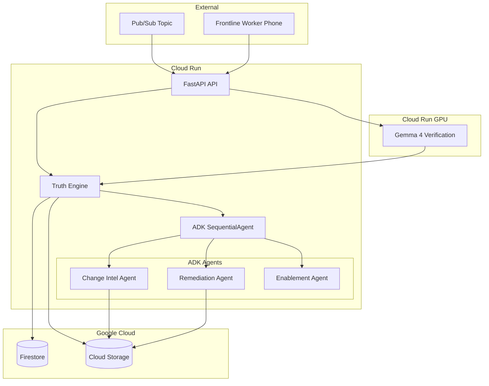

# Implementation Plan: Hero Change Deployment

**Branch**: `001-hero-change-deployment` | **Date**: 2026-08-17 | **Spec**: [spec.md](spec.md)

## Summary

DRIFTZERO's hero workflow autonomously processes an approved operational procedure change (LEFT → TOP-RIGHT label placement), identifies the affected downstream artifact, remediates it, delivers the delta to a frontline worker, verifies physical execution via camera evidence, and produces an immutable Change Proof. The implementation uses a hybrid deterministic + LLM architecture: a pure-Python Truth Engine owns all authoritative state/transitions/invariants while Google ADK Python agents handle semantic interpretation tasks (change extraction, remediation composition, delta delivery, vision observation). Gemini 3.5 Flash powers the semantic agents; Gemma 4 provides multimodal field verification, gated by the G1 feasibility spike and backed by a documented deterministic/manual observation fallback; Veo 3.1 optionally generates microtraining video. Firestore is the authoritative state store; Pub/Sub provides event-driven ingestion; Cloud Run hosts the runtime; Cloud Storage holds immutable evidence. Gemini Enterprise Agent Platform (GEAP) capabilities — Agent Runtime, Agent Registry, Agent Identity, Agent Gateway, Model Armor, advanced Agent Observability — are **track enhancements gated on account access**; the core hero workflow runs entirely on Cloud Run + ADK + Firestore + Pub/Sub + Cloud Storage and never depends on successful GEAP provisioning.

## Technical Context

**Language/Version**: Python 3.11+
**Primary Dependencies**: google-adk>=2.0.0, google-cloud-firestore, google-cloud-pubsub, google-cloud-storage, fastapi, uvicorn, pydantic>=2.0
**Storage**: Firestore (Standard Edition) for workflow state; Cloud Storage for raw evidence/artifacts
**Testing**: pytest, pytest-asyncio
**Target Platform**: Cloud Run (serverless containers), optional Agent Runtime
**Project Type**: Multi-agent enterprise workflow service with thin web frontend
**Performance Goals**: Hero workflow completion in <5 minutes (excluding async field verification wait). Field verification response <10 seconds.
**Constraints**: Hackathon credit budget. Single developer. Scale-to-zero when idle.
**Scale/Scope**: 1 concurrent workflow sufficient for demo. Not a production platform.

## Constitution Check

*GATE: Must pass before Phase 0 research. Re-check after Phase 1 design.*

| # | Principle | Status | Notes |
|---|---|---|---|
| I | Spec Before Code | PASS | Frozen spec exists with 11 FRs, 15 SCs |
| II | Evidence Over Claims | PASS | Evidence pack designed, no invented metrics |
| III | Deterministic Truth Boundary | PASS | Truth Engine owns all authoritative logic |
| IV | Least Privilege | PASS | Per-agent permission boundaries defined; primary model is one Agent Identity per agent, with per-agent service accounts as the explicit fallback runtime identity |
| V | Safe Autonomous Action | PASS | 9-condition autonomy gate, REVIEW_REQUIRED default |
| VI | Persistent State ≠ LLM Memory | PASS | Firestore is authoritative, not ADK session/Memory Bank |
| VII | Observable by Default | PASS | Correlation IDs, state transition logs, agent traces |
| VIII | Failure Is First-Class | PASS | 13 lifecycle states including FAILED, REVIEW_REQUIRED, VERIFICATION_INCONCLUSIVE |
| IX | Google-Native Where It Matters | PASS | Gemini 3.5 Flash + ADK + Firestore + Pub/Sub + Cloud Run + Gemma 4 |
| X | Frontline-First | PASS | Worker receives delta, phone-based verification |
| XI | Narrow Complete Core | PASS | One hero workflow, no dashboard, no auth system |
| XII | Hackathon Reproducibility | PASS | Fixtures, quickstart, evidence pack, JUDGES_START_HERE |
| XIII | No Hidden Simulation | PASS | Data classification with lineage; synthetic fixtures labeled |
| XIV | Definition of Done = Verified | PASS | Test strategy maps to every FR and SC |

## Project Structure

```text
specs/001-hero-change-deployment/
├── spec.md
├── plan.md              # This file
├── research.md
├── data-model.md
├── quickstart.md
├── contracts/
│   └── agents.md
└── checklists/
    └── requirements.md
```

```text
src/
├── driftzero/
│   ├── __init__.py
│   ├── truth_engine/           # Deterministic core (NO LLM)
│   │   ├── __init__.py
│   │   ├── state_machine.py    # 13 states, legal transitions
│   │   ├── idempotency.py      # Duplicate detection
│   │   ├── supersession.py     # Version applicability
│   │   ├── autonomy_gate.py    # 9-condition remediation check
│   │   ├── verification.py     # Expected vs observed comparator
│   │   ├── proof_generator.py  # 7-invariant check + SHA-256 proof
│   │   └── evidence.py         # Evidence manifest, data classification
│   ├── agents/                 # ADK agent definitions
│   │   ├── __init__.py
│   │   ├── change_intel.py     # Change Intelligence Agent
│   │   ├── remediation.py      # Remediation Agent
│   │   ├── enablement.py       # Frontline Enablement Agent
│   │   ├── field_verify.py     # Field Verification Agent (Gemma)
│   │   └── orchestrator.py     # SequentialAgent workflow
│   ├── models/                 # Pydantic data models
│   │   ├── __init__.py
│   │   ├── change.py           # ApprovedChange, ChangeSet
│   │   ├── workflow.py         # Workflow, WorkflowState
│   │   ├── verification.py     # VerificationEvent, FieldObservation
│   │   ├── proof.py            # ChangeProof, EvidenceManifest
│   │   └── classification.py   # DataClassification, LineageEntry
│   ├── store/                  # Persistence layer
│   │   ├── __init__.py
│   │   ├── firestore.py        # Firestore client
│   │   └── gcs.py              # Cloud Storage client
│   ├── api/                    # FastAPI routes
│   │   ├── __init__.py
│   │   └── routes.py
│   ├── web/                    # Thin HTML/JS demo frontend
│   │   ├── static/
│   │   └── templates/
│   └── cli.py                  # CLI for testing/demo
├── tests/
│   ├── unit/
│   │   └── truth_engine/       # Deterministic logic tests
│   ├── integration/            # Agent + store integration
│   ├── multimodal/             # Gemma fixture evaluation
│   └── security/               # Prompt injection tests
├── fixtures/                   # Reproducible test fixtures
│   ├── hero_change.json
│   ├── stale_artifact.json
│   ├── unrelated_artifact.json
│   └── multimodal/
├── evidence/                   # Evidence pack (see quickstart.md)
├── Dockerfile
├── pyproject.toml
└── .env.example
```

## Architecture

### Component Diagram



### Google Service Decision Matrix

| Technology | Classification | Justification |
|---|---|---|
| Gemini 3.5 Flash | `CORE` | Primary LLM for semantic agents. Hackathon-mandatory. |
| Google ADK Python 2.0 | `CORE` | Agent framework with deterministic workflow support. |
| Firestore | `CORE` | Authoritative workflow state, idempotency, proof records. |
| Pub/Sub | `CORE` | Event-driven change ingestion (real event, synthetic content). |
| Cloud Run | `CORE` | Serverless compute runtime for agents and API. |
| Cloud Storage | `CORE` | Immutable evidence store for artifacts and raw evidence. |
| Gemma 4 12B | `DEMO_CRITICAL` | Multimodal field verification (second Google AI model). Promoted to the demo only after the G1 feasibility gate returns GO; FR-005 requires a normalized observation and a deterministic comparator, not this specific model, so a FALLBACK decision leaves S1 acceptance intact. |
| Veo 3.1 | `BONUS` | Optional microtraining video generation. Non-blocking. |
| Agent Runtime | `TRACK_ENHANCEMENT` | Managed async execution. Use if accessible; Cloud Run is the fallback. |
| Agent Registry | `TRACK_ENHANCEMENT` | Prerequisite for the Agent Gateway path (Gateway blocks egress to unregistered hosts). Also provides agent discovery evidence. |
| Agent Identity | `TRACK_ENHANCEMENT` | One SPIFFE-based Agent Identity per agent, used as the IAM principal in tool authorization policies. NOT a service account. |
| Agent Gateway | `TRACK_ENHANCEMENT` | One exact governed egress path: Remediation Agent → Gateway → Artifact Mutation Tool, with an enforced DENY for the Frontline Enablement Agent. |
| Model Armor | `TRACK_ENHANCEMENT` | Screening of untrusted artifact **text** at the Vertex AI `generateContent` call only. Not an authorization mechanism. |
| Agent Observability (advanced) | `TRACK_ENHANCEMENT` | Platform-level agent/gateway telemetry. Fallback is OpenTelemetry + Cloud Trace/Logging from Cloud Run. |
| Memory Bank | `DEFER` | Adds complexity without improving hero workflow truth. |
| Lyria 3 | `DEFER` | Weak frontline use case, poor effort-to-value ratio. |

### Deterministic Truth Engine

The Truth Engine is pure Python application logic (NO LLM calls). It owns:

- **State machine**: 13 canonical states, validated legal transitions
- **Idempotency**: `change_id`-based duplicate detection
- **Supersession**: Source version applicability check; automatic `SUPERSEDED` transition
- **Autonomy gate**: 9 preconditions evaluated deterministically
- **Verification comparator**: `observed == expected → PASS`, else `FAIL` or `INCONCLUSIVE`
- **Event ordering**: Monotonic `event_sequence` per workflow
- **Proof invariants**: 7 conditions checked before `PROOF_COMPLETE`
- **Evidence manifest**: SHA-256 content hashes for all referenced artifacts
- **Retry deduplication**: Completed logical actions tracked, not re-executed

### Orchestration Strategy

**Hybrid deterministic + LLM**: ADK `SequentialAgent` defines the macro workflow. The Truth Engine validates preconditions/postconditions at each step boundary. LLM agents handle semantic tasks within their bounded scope.

**Agent hallucination handling**: Every agent output is validated against Pydantic schemas by the Truth Engine. Invalid structured output → retry with timeout → `REVIEW_REQUIRED`. Schema validity alone never authorizes a state transition — see § Trust-Boundary Validation Policy, which governs every non-authoritative result crossing into the Truth Engine.

### Agent Identity and Runtime Identity Model

Two distinct concepts, never conflated (see research.md R-013):

- **Agent Identity** — a SPIFFE-based, per-agent cryptographic identity issued by Google Cloud when an agent is deployed to Agent Runtime with agent identity enabled. It is not shared across workloads, cannot be impersonated, and has no long-lived keys. It is used as an IAM **principal** in allow policies:
  `principal://agents.global.org-ORGANIZATION_ID.system.id.goog/resources/aiplatform/projects/PROJECT_NUMBER/locations/LOCATION/reasoningEngines/AGENT_ENGINE_ID`
- **Service account** — a conventional Google Cloud principal (`serviceAccount:NAME@PROJECT.iam.gserviceaccount.com`). In DRIFTZERO a service account is used **only** as (a) a Cloud Run service/runtime identity, or (b) the explicit fallback identity when Agent Identity cannot be provisioned. A service account is never called an "Agent Identity".

**Primary model (GEAP available) — one Agent Identity per agent:**

| Agent | Agent Identity | Authorized capability boundary |
|---|---|---|
| Change Intelligence Agent | `driftzero-change-intel` agent identity | READ-ONLY: approved source procedure (GCS), artifact registry (Firestore). No mutation capability of any kind. |
| Remediation Agent | `driftzero-remediation` agent identity | **The only identity authorized to invoke the Artifact Mutation Tool.** Read affected artifact; write only authorized derived artifacts. No write to the authoritative source. |
| Frontline Enablement Agent | `driftzero-enablement` agent identity | READ + NOTIFY: read ChangeSet/remediation result, deliver delta, optionally call Veo. **Explicitly NOT authorized for the Artifact Mutation Tool** — this is the negative security test subject. |
| Field Verification Agent | `driftzero-field-verify` agent identity (where the agent is deployed on Agent Runtime; if it remains a Cloud Run GPU inference service, that service runs under its own dedicated Cloud Run service account and is documented as a runtime identity, not an Agent Identity) | READ raw evidence + inference only. No workflow state authority, no PASS/FAIL authority, no mutation capability. |

**Fallback model (Agent Identity not provisionable):** each agent runs under its own dedicated, minimally-scoped Cloud Run **service account**, and the mutation-capability restriction is enforced by a deterministic in-process authorization broker in the Truth Engine keyed on the calling agent identifier. This fallback is weaker (bearer-token principals, impersonation possible, no cryptographic per-agent attestation) and MUST be recorded as such in `LIMITATIONS.md`. No evidence artifact may describe the fallback as platform-enforced Agent Identity.

### Agent Gateway Governed Path

Exactly one governed path is planned for the track enhancement. Official capability review (research.md R-003, Agent Gateway) confirms this path is supported: the Gateway governs **Agent-to-Anywhere (egress)** HTTP traffic including MCP, authorizes on the calling agent's SPIFFE identity, and can restrict access to individual MCP tools by tool name and read-only/read-write character. It is therefore planned concretely rather than deferred, but it stays subject to the GEAP Availability Gate.

| Attribute | ALLOW case | DENY case (negative security test) |
|---|---|---|
| **Traffic direction** | Egress (Agent-to-Anywhere) | Egress (Agent-to-Anywhere) |
| **Caller** | Remediation Agent, authenticating with its Agent Identity (SPIFFE principal) | Frontline Enablement Agent, authenticating with its Agent Identity |
| **Path** | Remediation Agent → Agent Gateway → Artifact Mutation Tool | Frontline Enablement Agent → Agent Gateway → Artifact Mutation Tool → **DENIED** |
| **Target tool** | `artifact-mutation-tool`, registered in Agent Registry, exposing one read-write operation `apply_authorized_artifact_patch` | Same registered tool and operation |
| **Required identity** | `principal://agents.global.org-.../reasoningEngines/driftzero-remediation` | `principal://agents.global.org-.../reasoningEngines/driftzero-enablement` |
| **Allow policy** | `roles/iap.egressor` on the registered mutation-tool endpoint granted to the Remediation Agent principal only, plus an MCP tool-name-scoped authorization policy permitting the read-write tool for that principal | No `roles/iap.egressor` binding and no tool-name allow entry for the Enablement principal → IAP runtime enforcement rejects the call |
| **Expected audit evidence** | Gateway network-layer telemetry (Agent Observability), Cloud Logging entry carrying the caller SPIFFE principal + tool name + allow decision, Cloud Trace span, and the Truth-Engine-recorded before/after artifact refs | Cloud Logging deny entry carrying the caller SPIFFE principal + tool name + deny decision, plus positive proof of non-effect: artifact SHA-256 unchanged and no `REMEDIATION_COMPLETED` transition. Stored as `evidence/security/gateway_deny_enablement_to_mutation_tool.json` |

**Rules:**
- The Artifact Mutation Tool is **not implemented in this correction**. It is specified here only as a planned authenticated tool/service compatible with the Gateway protocol selected at implementation time (MCP is the documented option that supports per-tool authorization).
- If Agent Gateway is promoted to the demo, the DENY must come from **real platform authorization/policy enforcement**, not from an application-level check. `DRY_RUN` (`iamEnforcementMode`) may be used during staging to capture would-be-deny audit entries, but a demo claim of enforcement requires enforcement mode.
- If Agent Gateway is not accessible (see GEAP Availability Gate), the ALLOW/DENY pair still executes against the in-process deterministic authorization broker, and the evidence is labelled **application-level enforcement, not platform-enforced**. No judged claim of Gateway enforcement may be made in that case.

### Model Armor Enforcement Path

Model Armor has one narrow role: screening **untrusted text** before it is processed by an LLM agent. It is deliberately kept separate from domain authorization.

**Exact path:**
`untrusted artifact TEXT → Vertex AI generateContent call carrying modelArmorConfig.promptTemplateName → Model Armor screening (INSPECT_AND_BLOCK) → Change Intelligence Agent processing only if allowed`

- **Screened content**: text extracted from the derived downstream operational artifact and from the approved-change payload, i.e. the untrusted strings interpolated into Change Intelligence Agent prompts. Model responses are screened via `responseTemplateName`.
- **Enforcement point**: the Vertex AI `generateContent` request itself — the only integration Google documents for this traffic (research.md R-003, Model Armor). This path requires neither Agent Gateway nor Agent Registry nor a Google Cloud Organization, so it survives independently if the Gateway path is unavailable.
- **Template**: `driftzero-untrusted-artifact-text`, enforcement `INSPECT_AND_BLOCK`, targeting prompt injection and jailbreak detection.
- **On block**: the call returns `blockReason: "MODEL_ARMOR"`; the Truth Engine records a `ScreeningBlocked` evidence item (classification `REAL`) and the workflow fails closed to `REVIEW_REQUIRED`. It never proceeds on unscreened content silently.
- **On documented fail-open**: Google documents that during a Model Armor outage the sanitization step is skipped and processing continues. The Truth Engine therefore records `SCREENING_SKIPPED` in the evidence manifest so no evidence artifact can claim screening that did not happen, and all Truth Engine scope/authorization/semantic validation still applies.
- **Not screened**: field verification images. Model Armor image screening is Preview and document content is explicitly unsupported; image evidence integrity is handled by hashing plus the deterministic comparator, and this limitation is stated in `LIMITATIONS.md`.
- **Adversarial fixture**: one reproducible text fixture, `fixtures/security/injected_artifact_text.json` — a downstream artifact whose instruction text embeds an injection attempting to redirect the agent (e.g. instructing it to mark an unauthorized artifact as remediated).

**Model Armor MUST NOT be described as enforcing** artifact authorization, workflow state transitions, proof completion conditions, or semantic correctness of structured business data. Those are Truth Engine responsibilities and remain deterministic and local, exactly as they are in the fallback architecture where Model Armor is absent.

### Trust-Boundary Validation Policy (Tool Poisoning & Non-Authoritative Output Defense)

**General principle**: *every non-authoritative agent or tool result crossing into the deterministic Truth Engine MUST be validated before it can affect authoritative workflow state.* No agent output, and no tool response, is trusted because it is well-formed. Schema validity is a necessary first filter, never a sufficient one.

**Threat — Tool Poisoning / Malicious Result**: a tool, MCP server, compromised endpoint, or hallucinating agent returns a response that is **schema-valid but semantically unauthorized** — naming an artifact outside `authorized_scope`, citing a `source_version` inconsistent with the workflow, referencing objects the workflow never wrote, or asserting an outcome that never occurred. Pydantic accepts all of these because the shape is correct.

**Validation is context-appropriate, not uniform.** The full remediation chain does not apply identically to every result; each crossing has a defined minimum. Every layer below is deterministic Truth Engine logic with no LLM participation, and every layer holds identically in the fallback architecture where no Agent Gateway and no Model Armor exist.

#### Crossing 1 — Change Intelligence output (`ChangeSet`)

Minimum validation: schema · workflow/change provenance (`change_id` + `correlation_id` match the workflow under processing) · source-version association (`source_version` is the applicable, non-superseded version) · expected source and artifact identities (referenced artifact IDs exist in the registry; the source procedure ID is the one ingested) · semantic domain invariants (`previous_value` matches the recorded prior approved value; exactly one atomic requirement change is described).

**Authority boundary**: the agent MAY propose impact candidates with reasons. It does NOT determine impact. The Truth Engine decides whether the FR-002 impact requirements (operation match, instruction correspondence, value conflict, authorized scope) are satisfied, and an `is_affected` flag returned by the agent is treated as a proposal, never as a decision.

#### Crossing 2 — Remediation result (`RemediationEvidence`)

Minimum validation: schema · provenance/correlation · expected tool identity (the response came from the registered tool the agent was authorized to call) · expected artifact identity (`artifact_id` equals the artifact the Truth Engine targeted) · authorization scope (`artifact_id ∈ authorized_scope`; the caller is the mutation-authorized identity) · source-version applicability · before-state hash consistency (`before_hash` equals the pre-state hash the Truth Engine recorded before invoking remediation) · atomic-change invariants (exactly one requirement changed; `after_value` equals the approved `current_value`; no additional divergence; authoritative source untouched).

**Discriminated outcome**: the result is validated as either `MutationEvidence` or `NoOpEvidence` (data-model.md § RemediationEvidence). A `NO_OP` claim is validated on its own terms — evaluated-artifact hash and observed-vs-expected equality — and MUST NOT be accepted with a fabricated before/after pair.

#### Crossing 3 — Delivery result (`DeliveryResult`)

Minimum validation: schema · workflow/change provenance · intended worker/demo identity (matches the workflow's `worker_id`) · expected delivery operation and channel (the mechanism the workflow selected) · **positive delivery evidence/receipt** (a resolvable delivery reference produced by the delivery mechanism) · source-version applicability.

**Authority boundary**: an agent asserting "delivered" in text is insufficient and MUST NOT satisfy FR-004. `DELIVERED` is recorded only on positive evidence from the delivery mechanism itself. Absent that evidence the action is not marked completed and retry is permitted.

#### Crossing 4 — Field observation (`FieldObservation`)

Minimum validation: schema · workflow/change provenance · raw evidence reference (resolvable, hash-recorded, and associated with this workflow) · expected verification operation · allowed normalized observation enum (`LEFT` | `TOP_RIGHT` | `INCONCLUSIVE` — any other value is rejected, not coerced) · event chronology/sequence (monotonic `event_sequence`; an older event cannot override a newer one) · source-version applicability.

**Authority boundary**: `FieldObservation` MUST NOT carry authoritative PASS/FAIL, and any confidence value it carries is informational only and never authoritative. The Truth Engine performs the comparator: `observed == expected → PASS`, `observed != expected and observed != INCONCLUSIVE → FAIL`, else `INCONCLUSIVE`.

#### Crossing 5 — Veo optional output

Minimum validation: schema · workflow/change provenance · asset reference resolvable · data classification recorded.

**Authority boundary**: successful media generation NEVER establishes delivery truth. FR-004 requires actual delivery evidence through the selected delivery mechanism (Crossing 3). A generated asset is supplementary content attached to a delivery that must independently prove itself, and Veo failure has no effect on delivery status or `PROOF_COMPLETE`.

#### Rejection behavior (all crossings)

A result failing any applicable layer is recorded as evidence (`REAL`, naming the rejecting layer and crossing) into `EvidenceManifest.rejected_result_refs`, MUST NOT advance the workflow, MUST NOT be treated as the action having occurred, and MUST NOT contribute to any proof completion condition. Repeated failure after the retry cap enters `REVIEW_REQUIRED`.

**Relationship to optional platform controls**: Agent Gateway restricts *which* tools an agent may call and Agent Registry restricts *which* hosts exist; Model Armor screens untrusted *text*. None of them validates the *content* of a result against DRIFTZERO business invariants. They are complementary to — never a substitute for — this policy, and this policy is mandatory whether or not any of them is provisioned.

#### Planned contract-validation coverage (design only — not implemented in this remediation)

| Crossing | Planned validation coverage | Evidence artifact |
|---|---|---|
| ChangeSet | Provenance mismatch, superseded source version, unknown artifact ID, agent-asserted `is_affected` without satisfied conditions | `security/changeset_rejected.json` |
| RemediationEvidence | Schema-valid response naming an unauthorized artifact; inconsistent `source_version`; `before_hash` mismatch; `NO_OP` claimed with fabricated after-state | `security/tool_poisoning_rejected.json` |
| DeliveryResult | `delivered: true` with no resolvable delivery receipt; wrong worker identity | `security/delivery_assertion_rejected.json` |
| FieldObservation | Out-of-enum observation value; observation carrying a PASS/FAIL claim; out-of-order `event_sequence` | `security/observation_rejected.json` |
| Veo output | Generation success used to imply delivery | Covered by the DeliveryResult case |

### GEAP Availability Gate

Every component below stays `TRACK_ENHANCEMENT` until proven accessible in the actual hackathon account. The core hero workflow MUST NOT depend on successful GEAP provisioning; **Cloud Run + ADK + Firestore + Pub/Sub + Cloud Storage remain the fallback core** and are sufficient for FR-001–FR-011 and SC-001–SC-015. Gate results are recorded in `evidence/geap_access_gate.json` with an explicit PASS/FAIL per component.

| Component | ACCESS_CHECK | SUCCESS CONDITION | FALLBACK |
|---|---|---|---|
| Agent Runtime | Enable `aiplatform.googleapis.com` (+ storage/logging/monitoring/cloudtrace/telemetry/cloudresourcemanager); deploy a trivial ADK agent to Agent Runtime | Agent deploys and responds to an invocation; a `reasoningEngines/...` resource exists | Cloud Run-hosted ADK (`adk deploy cloud_run`) with ADK `ResumabilityConfig` for pause/resume |
| Agent Registry | Enable `agentregistry.googleapis.com`; register one dummy endpoint and read it back | Registry entry created and listable | Local `fixtures/agent_registry.json` manifest, explicitly labelled `SIMULATED` — no claim of platform registry |
| Agent Identity | Confirm the project has an organization parent (`gcloud projects describe $PROJECT_ID --format='value(parent)'`); deploy one agent with agent identity enabled; bind a role to the `principal://...` member | IAM binding with the `principal://` member is accepted and the agent obtains a working token | Dedicated per-agent Cloud Run **service accounts** + in-process deterministic authorization broker; documented in `LIMITATIONS.md` as not Agent Identity |
| Agent Gateway | Enable the 12 documented APIs; `gcloud network-services agent-gateways import`; import the authz extension in `DRY_RUN`, then enforcement | Gateway + authz policy created; ALLOW case succeeds and DENY case is rejected by IAP enforcement with a deny log entry | In-process deterministic authorization broker in the Truth Engine; ALLOW/DENY pair still demonstrated, evidence labelled application-level enforcement |
| Model Armor | Enable `modelarmor.googleapis.com`; create template `driftzero-untrusted-artifact-text`; grant `roles/modelarmor.user` to the Vertex AI service agent; call `generateContent` with `modelArmorConfig` on the adversarial fixture | Injection fixture is blocked with `blockReason: "MODEL_ARMOR"`; the clean fixture passes | Deterministic untrusted-content handling only: content quarantining, no-instruction-following prompt contract, and the Truth Engine trust-boundary layers for Crossing 1; `LIMITATIONS.md` records that no external guardrail ran |
| Advanced Agent Observability | After Runtime/Gateway provisioning, confirm agent and gateway telemetry appear in Agent Observability | Traces/spans for agent and gateway interactions are visible and exportable | OpenTelemetry instrumentation from Cloud Run into Cloud Trace + Cloud Logging with correlation IDs (satisfies Constitution VII) |

**Scope note**: these components are infrastructure/governance enhancements. They do not add product scope — spec.md Non-Goals still exclude implementing them as product features, and no FR or SC depends on any of them. If every gate fails, the deliverable is unchanged.

### Downstream Artifact Design

**Decision**: JSON-backed work instruction with human-readable rendering.
**Rationale**: JSON enables deterministic patchability with `jq`-style atomic field replacement. Before/after evidence is the raw JSON diff. Human-readable rendering (HTML/Markdown) is generated for the demo surface. Google Drive/Docs deferred due to OAuth/domain complexity.

### Data Classification Design

Non-exclusive lineage model using `DataClassification(labels=["REAL", "SYNTHETIC"], lineage=[...])`. Each evidence item carries its own classification. Example lineage chains:
- Synthetic SOP fixture → `labels: [SYNTHETIC]`
- Real Gemini call processing synthetic fixture → `labels: [REAL], lineage: [{source: fixture, classification: [SYNTHETIC]}]`
- Derived Gemma observation from real photo of demo box → `labels: [DERIVED, REAL], lineage: [{source: photo, classification: [REAL]}, {scenario: demo, classification: [SYNTHETIC]}]`
- Change Proof → `labels: [DERIVED], lineage: [all contributing evidence refs]`

### Change Proof Technical Design

- **Canonical format**: JSON evidence manifest containing all fields from `ChangeProof` model
- **Remediation evidence**: `remediation_evidence` is a discriminated union — `MutationEvidence` (before/after refs + both hashes) **or** `NoOpEvidence` (single evaluated-artifact ref + hash + compliance basis). Completion condition 3 is satisfied by exactly one path, each independently auditable. The proof never fabricates an after-state for an already-compliant artifact, and never renders a `NO_OP` as a diff (data-model.md § RemediationEvidence)
- **Integrity**: SHA-256 hash of canonical JSON (sorted keys, no whitespace)
- **Hash guarantee boundary**: content hashes establish **content identity and replacement/alteration detection** only. They do NOT provide a digital signature, trusted timestamp, identity attestation, proof of authorship, non-repudiation, or ledger/blockchain immutability. No evidence artifact, README, or judged claim may describe the Change Proof as cryptographically attested, signed, notarized, or blockchain-backed (spec.md § Change Proof, Integrity hash semantics)
- **Validation**: Deterministic `ProofValidator` checks all 7 completion invariants against the manifest
- **Rendering**: Human-readable HTML generated from canonical JSON for demo/judges (NOT the source of truth)
- **Immutability**: operationally defined as write-once application semantics — the Firestore proof document is not rewritten after creation, and the Cloud Storage object is written with a generation precondition. This is application-enforced immutability within one project's trust boundary; it is not an append-only ledger and is not tamper-proof against an actor holding project write credentials. `LIMITATIONS.md` states this plainly
- **Condition 7 implementation**: implemented exactly as written in spec.md (Change Proof Mandatory Completion Conditions, condition 7). The plan carries no independent interpretation of this condition. Deterministic encoding in `proof_generator.py`:
  - `workflow.current_state in {SUPERSEDED, FAILED}` → completion permanently denied (terminal non-success; no later evidence can re-open it).
  - `SUPERSEDED` or `FAILED` present anywhere in the state history → completion permanently denied (both are terminal, so occupancy and history are equivalent).
  - `REVIEW_REQUIRED` present anywhere in the state history → completion denied (no autonomous exit in this scope).
  - `workflow.current_state in {VERIFICATION_FAILED, VERIFICATION_INCONCLUSIVE}` → completion denied while current.
  - Historical `VERIFICATION_FAILED` / `VERIFICATION_INCONCLUSIVE` entries → **not** disqualifying, provided condition 5 holds (latest authoritative verification for the applicable source version/change is `VERIFICATION_PASSED`). Their evidence records are required inputs to condition 6 and are emitted into the proof evidence trail; deleting them fails proof validation.
  - This is what makes `FAIL → corrected evidence → PASS → PROOF_COMPLETE` (US6) executable without weakening any other condition.

### Security Threat Analysis

| Threat | Prevention | Detection | Evidence |
|---|---|---|---|
| Prompt injection in artifact text | Model Armor screening at the `generateContent` call (text only, `INSPECT_AND_BLOCK`); untrusted-content prompt contract; Truth Engine trust-boundary validation at Crossing 1 regardless of screening | `blockReason: "MODEL_ARMOR"` response; `ScreeningBlocked` / `SCREENING_SKIPPED` evidence | `security/prompt_injection_blocked.json` |
| **Tool poisoning / malicious result** (schema-valid, semantically unauthorized) | Trust-Boundary Validation Policy applied at all five crossings (ChangeSet, RemediationEvidence, DeliveryResult, FieldObservation, Veo output) with context-appropriate layers. Schema validation alone is insufficient at every crossing. Agent Gateway tool-scoped allow policy where available | Rejection record naming the crossing and failing layer; artifact hash unchanged; no state advance | `security/tool_poisoning_rejected.json` and per-crossing rejection artifacts |
| **Unearned delivery / verification claim** (agent asserts an outcome that did not occur) | `DELIVERED` requires a resolvable delivery receipt from the delivery mechanism; `FieldObservation` may not carry PASS/FAIL; Veo success never implies delivery | Missing-receipt rejection log; out-of-enum observation log | `security/delivery_assertion_rejected.json`, `security/observation_rejected.json` |
| Unauthorized master mutation | No write tool provided to any agent for source procedure | Tool invocation audit | Agent trace logs |
| Cross-agent privilege escalation | Primary: one Agent Identity per agent, with the mutation capability bound to the Remediation Agent principal only (Enablement Agent explicitly denied). Fallback: dedicated per-agent service accounts + deterministic in-process authorization broker | IAM audit logs; Gateway allow/deny decisions carrying the caller SPIFFE principal | Cloud Audit Logs; `security/gateway_deny_enablement_to_mutation_tool.json` |
| Duplicate event replay | `change_id` idempotency in Truth Engine | Duplicate detection log | State transition log |
| Forged evidence reference | SHA-256 content hash verification in proof validator | Hash mismatch alert | Integrity check report |
| PII leakage | Opaque worker IDs; no real employee data in fixtures | Fixture review | Data classification labels |
| Synthetic-as-real misrepresentation | Explicit data classification with lineage | Classification audit | Evidence manifest |
| Stale version completion | Supersession check on every state transition | SUPERSEDED state log | State transition log |
| Malicious field upload | Gemma output schema validation; deterministic comparator | Invalid observation log | Verification event log |

### Test Strategy

| Group | Tests | Covers |
|---|---|---|
| **Unit: Truth Engine** | State transitions (legal/illegal), 7 proof invariants, idempotency, supersession, verification ordering, autonomy gate (9 conditions), no-op remediation, retry deduplication, data classification lineage, hash integrity | FR-001–FR-011, SC-001–SC-015 |
| **Integration: Agent + Store** | Change event → persisted workflow, Gemini ChangeSet extraction, authorized remediation + GCS evidence, delivery receipt, proof generation + Firestore persistence | FR-001–FR-006 |
| **Agent: Output Validation** | Structured output conformance, hallucinated output rejection, tool permission denial, timeout handling | FR-011 |
| **Multimodal: Gemma** | LEFT fixtures → `LEFT` observation, TOP_RIGHT fixtures → `TOP_RIGHT`, ambiguous fixtures → `INCONCLUSIVE` | SC-006, SC-007, SC-012 |
| **Security** | Prompt injection in artifact **text** → blocked at the `generateContent` screening point (or deterministically quarantined in fallback); tool poisoning: schema-valid but unauthorized result rejected at each of the five crossings (unauthorized artifact, unearned `DELIVERED`, out-of-enum or PASS/FAIL-bearing observation, `NO_OP` with fabricated after-state); Agent Gateway ALLOW (Remediation Agent → Artifact Mutation Tool) and DENY (Enablement Agent → Artifact Mutation Tool) | FR-002, FR-003, FR-004, FR-005, FR-011; Model Armor path; Gateway path; Trust-Boundary Validation Policy |

### Cost Strategy

**Claim discipline**: this project does not publish a precise predicted project total. A monetary figure appears only where it is derived from a documented unit price **and** an explicitly stated usage assumption, and every such figure is labelled `ESTIMATED`. `ACTUAL COST OBSERVED` values are read from Google Cloud billing after the fact and recorded separately in `evidence/cost_model.json`. The two are never merged into one number, and no cost-savings or efficiency claim is made anywhere in judged material (Constitution Principle II).

**Unit-price drivers** (rates are read from the linked official pricing pages at implementation time and recorded in `evidence/cost_model.json`; see research.md R-015):

| Component | Billing unit | Documented rate at plan time | Relative cost risk | Safeguard |
|---|---|---|---|---|
| Firestore | Document reads / writes / stored GiB | Free-tier dominated at demo volume; rate from pricing page | LOW | Budget alert; demo volume is a handful of documents |
| Pub/Sub | Message throughput (GiB) | Free-tier dominated at demo volume | LOW | Budget alert |
| Cloud Storage | Stored GiB/month + operations | Standard-class storage rate from pricing page | LOW | Object lifecycle policy on evidence bucket |
| Cloud Run (CPU) | CPU-second, GiB-second, request | Rate from Cloud Run pricing page | LOW | `--max-instances=2`; scale-to-zero when idle |
| Cloud Run (GPU, Gemma 4) | GPU-second (NVIDIA L4) + CPU/memory | Rate from Cloud Run pricing page | **HIGH** — the dominant driver | `--max-instances=1`; scale-to-zero; GPU service stopped between sessions; per-session wall-clock cap |
| Gemini 3.5 Flash | Per 1M input tokens / 1M output tokens | Rate to be captured from the Gemini pricing page | MEDIUM | Short prompts, structured output, retry cap of 2 per agent step |
| Model Armor (if gate passes) | Total tokens in prompts + responses | Token-based per official overview | LOW | Only screens artifact text on the Change Intelligence path |
| Veo 3.1 (BONUS) | Output tokens: 5,792 tokens per second of 720p video ≈ **$0.10 per generated second** (Standard) | Documented | MEDIUM | Hard cap: ≤5 development generations, ≤2 demo generations, ≤6s each. Cap-derived: ~$0.60 per 6s clip `ESTIMATED`; ≤$3 development video spend `ESTIMATED` |

**Hard caps and guards (the actual budget control):**
- Development budget cap: **$50 internal budget alert** (with earlier notifications at $25 and $75 configured in Cloud Billing).
- Generation-count caps: Veo ≤5 development + ≤2 demo generations, ≤6 seconds each.
- `--max-instances`: 2 for CPU Cloud Run services, **1** for the Cloud Run GPU (Gemma) service.
- GPU service is deployed with scale-to-zero and is explicitly stopped/undeployed outside working sessions.
- Every generation-bearing call (Veo, GPU inference) is counted in `evidence/cost_model.json` so `ACTUAL COST OBSERVED` can be reconciled against the caps.

**Reconciliation**: after the demo, actual billing figures are exported from Cloud Billing into `evidence/cost_model.json` under `actual_cost_observed`, alongside the `estimated` block. Judged material cites only the observed figures for actual spend.

### Implementation Milestones (Risk-First, with Binding Exit Gates)

Milestones are ordered by risk retirement, not by visibility. Every milestone has an **EXIT GATE**: work downstream of a gate is not considered complete until that gate passes. `/speckit.tasks` MUST honour the Task Ordering Rules that follow this table.

**M0 — Deterministic Truth Engine** (highest priority, zero cloud dependency)

Must prove:
- canonical 13-state machine
- legal / illegal transitions
- 9 remediation preconditions
- mutation / no-op semantics (discriminated `RemediationEvidence`)
- idempotency
- retry deduplication
- verification chronology
- `FAIL → later PASS` recovery
- supersession
- seven `PROOF_COMPLETE` invariants
- deterministic Change Proof generation
- evidence integrity and lineage

**EXIT GATE**: all deterministic tests corresponding to the above pass with **zero cloud dependency**. No M1 core work is considered complete before M0 passes.

---

**RISK SPIKE G1 — Gemma Feasibility** (early, small, non-blocking — NOT M4 implementation)

Runs early, in parallel with M0/M1, specifically to retire physical-verification risk *before* any investment in optional infrastructure. Must determine:
- Gemma model access
- serving route (Vertex AI Model Garden vs Cloud Run + vLLM)
- GPU/quota feasibility where applicable
- whether the physical `LEFT` / `TOP_RIGHT` / `INCONCLUSIVE` fixture set is **empirically distinguishable**

**EXIT GATE**: a recorded **GO / FALLBACK** decision in `evidence/g1_gemma_feasibility.json`, including the fixture results that justify it.

**If FALLBACK**: the product core remains valid using deterministic/manual observation fixtures — FR-005 requires a normalized observation and a deterministic comparator, not a specific model — and the live-demo strategy is adjusted honestly in `LIMITATIONS.md`. G1 MUST occur **before** any optional GEAP work.

---

**M1 — Gemini + ADK Semantic Workflow**

Must prove: synthetic approved change → structured `ChangeSet` → validated impact → authorized remediation request → delta composition, with **all agent outputs passing deterministic trust-boundary validation** (§ Trust-Boundary Validation Policy).

**EXIT GATE**: local end-to-end semantic workflow passes while the Truth Engine remains authoritative at every crossing.

---

**M2 — Real Cloud Event + Durable State**

Must prove: real Pub/Sub event → Cloud Run → Firestore authoritative workflow → Cloud Storage evidence → process restart/resume → zero duplicate logical actions.

**EXIT GATE**: restart/recovery and duplicate-event evidence recorded from **real Google Cloud execution**.

---

**M3 — Physical Gemma Verification** (promotes the G1 result into the demo if GO)

Must prove: real physical image → Gemma-derived normalized observation → deterministic comparator → FAIL / INCONCLUSIVE / PASS, with a versioned evaluation fixture set.

**EXIT GATE**: empirical results recorded. Gemma may become a live-demo dependency **only after this gate passes**. M3 does **not** depend on M4 and MUST NOT be sequenced after it.

---

**M4 — OPTIONAL Governed Enterprise Fleet** — `OPTIONAL / TRACK_ENHANCEMENT`

Begins only after the core through M2 is stable. May include, where accessible: Agent Runtime, Agent Registry, Agent Identity, Agent Gateway, Model Armor, advanced Agent Observability.

**EXIT GATE (per component)**: ACCESS_CHECK passes + real capability evidence captured + fallback documented. Components that fail their access gate are **DEFERRED, not faked**.

This milestone MUST NOT block M3 or core S1 acceptance. No FR or SC depends on it (spec.md § Non-Goals, Class B).

---

**M5 — OPTIONAL Veo Training Enhancement** — `OPTIONAL / BONUS`

Begins only after text-based delta delivery works and is evidenced.

**EXIT GATE**: at least one real project-generated Veo asset + generation evidence + the text fallback still working. Failure does not affect S1 completion and cannot prevent `PROOF_COMPLETE`.

---

**M6 — Demo Surface & Evidence Packaging**

Begins only after the M0–M3 core paths are stable. Includes the minimal hero UI / mobile field interaction and final evidence packaging — not visual polish ahead of core proof.

**EXIT GATE**: end-to-end reproducible hero flow + evidence pack + `LIMITATIONS.md` + `JUDGES_START_HERE.md`.

---

### Task Generation Ordering Rules (binding on `/speckit.tasks`)

1. **M0 tasks precede all dependent implementation tasks.**
2. **G1 Gemma feasibility must be scheduled EARLY** — before any optional infrastructure work.
3. **M1 depends on the relevant M0 truth contracts** and may not begin before they exist.
4. **M2 depends on stable M0/M1 boundaries.**
5. **M3 may proceed after M2 and MUST NOT depend on M4.**
6. **M4 is OPTIONAL and cannot block M3 or core acceptance.**
7. **M5 is OPTIONAL and cannot block core acceptance.**
8. **M6 polish may begin only after core hero functionality is stable.**
9. **Frontend polish may never be P0** ahead of M0–M3 core proof.
10. **No task belonging solely to an optional enhancement may become a prerequisite for FR-001–FR-011 acceptance.**

**Additional protocol-decision rule (CHK027)**: no Agent Gateway policy-implementation task may be generated before an explicit, recorded decision task selects the supported tool protocol (MCP vs plain HTTP) for the Artifact Mutation Tool. The decision task is a prerequisite of every Gateway implementation task, because per-tool authorization granularity depends on that choice.

### Deferred Scope

*(Distinct from the OPTIONAL enhancements in M4/M5: items below are not planned at all. See spec.md § Non-Goals for the normative Class A / Class B distinction.)*

- Lyria 3 audio generation
- Memory Bank integration
- Reviewer assignment/UI/SLA for REVIEW_REQUIRED
- Multi-worker/site support
- Generic SOP management
- Analytics dashboard
- Authentication system
- Post-completion drift detection
- Production enterprise credentials
- Mobile app polish

### Risk Register

| Risk | Severity | Mitigation |
|---|---|---|
| Agent Runtime access unavailable | LOW (core), MEDIUM (M4 only) | Fall back to Cloud Run-based ADK deployment; the core hero workflow never depends on Agent Runtime |
| Gemma 4 vision accuracy insufficient for demo | HIGH | Risk spike G1 settles this empirically and early, producing a recorded GO/FALLBACK decision; high-contrast labels; fallback to deterministic/manual observation fixtures with the limitation stated honestly |
| GPU quota unavailable in target region | MEDIUM | Try multiple regions; fallback to Vertex AI Model Garden endpoint |
| Veo 3.1 generation too slow for live demo | MEDIUM | Pre-generate and cache; fallback to text-only delta delivery |
| Agent Registry/Gateway/Identity not accessible in hackathon account | MEDIUM | GEAP Availability Gate with per-component ACCESS_CHECK/SUCCESS/FALLBACK; core workflow has zero GEAP dependency |
| Agent Identity requires an organization-scoped trust domain (`org-ORGANIZATION_ID`) that a personal hackathon project may lack | MEDIUM | Access check verifies the project's organization parent at M4 start (and may be run earlier at no cost); fallback to dedicated per-agent service accounts, documented honestly in `LIMITATIONS.md`. No FR/SC depends on this |
| Tool poisoning: schema-valid but unauthorized tool response | HIGH | Five-layer Truth Engine validation chain (provenance, artifact/tool identity, authorization/scope, semantic invariants); dedicated security test; independent of Gateway availability |
| Single developer time constraint | HIGH | Risk-first milestones with binding exit gates; M0–M2 plus G1 are the minimum viable demo; M4/M5 are droppable without affecting S1 acceptance |
| Cloud credit exhaustion | MEDIUM | $50 internal budget alert (plus $25/$75 notifications); GPU `max-instances=1` + scale-to-zero + stop between sessions; Veo generation caps; reconcile `ACTUAL COST OBSERVED` in `evidence/cost_model.json` |
| Model Armor fail-open during a service outage (documented behavior: sanitization step is skipped) | MEDIUM | Record `SCREENING_SKIPPED` in the evidence manifest so no screening is claimed that did not occur; Truth Engine validation chain still applies |
| Model Armor text-only limitation (documents unsupported, image screening Preview) | LOW | Screen artifact text only; field images covered by hashing + deterministic comparator; limitation stated in `LIMITATIONS.md` |

## Complexity Tracking

No constitution violations require justification. All architecture decisions align with the 14 principles.
